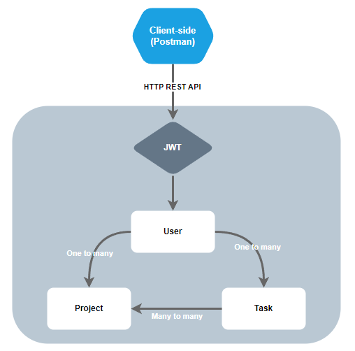
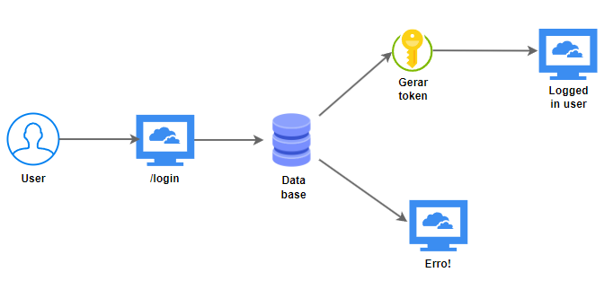

# project-manager-api
Projeto final da disciplina de Arquitetura Node.js no curso de pós-graduação em Arquitetura de Software Distribuído - PUC Minas.


### Descrição

O projeto final da disciplina consiste em desenvolver um produto de **gerenciamento de tarefas** como
mostra o desenho arquitetural de alto nível acima. Este projeto será subdividido em etapas, sendo:

1. Setup do ambiente de desenvolvimento e modelagem inicial dos dados;
2. Integração com banco de dados SQLite usando o padrão DTO, Repository e TypeORM;
3. Autenticação e autorização com OAuth;
4. GraphQL e Modelagem em microsserviços.




### Tecnologias utilizadas:
- Node.js
    > Node.js é uma ambiente de execução de JavaScript disponível para várias plataformas, de código aberto e gratuita, que permite os programadores criar servidores, aplicações da Web, ferramentas de linha de comando e programas de automação de tarefas.
- SQLite
    > Biblioteca de linguagem C que implementa um mecanismo de banco de dados SQL pequeno, rápido, independente, de alta confiabilidade e recursos completos. SQLite é o mecanismo de banco de dados mais usado no mundo. O SQLite está integrado em todos os telefones celulares e na maioria dos computadores, e vem integrado em inúmeros outros aplicativos que as pessoas usam todos os dias
- Redis
    > Redis (para REmote DIctionary Server) é um software livre, in-memory e um armazenamento de valor-chave NoSQL que é usado principalmente como um cache de aplicativos ou um banco de dados de resposta rápida
- Docker
    > Containerização do serviço de cache.
- Docker Compose
    > Orquestração dos containers.

### Requisitos para a compilação do projeto:
- Instalação IDE visual studio:
    > https://code.visualstudio.com/download
- Instalação typescript:
    > npm install typescript ts-node nodemon @types/node @types/express --save-dev
- Instalação NestJs:
    > npm i -g @nestjs/cli
- Instalação Docker:
    > https://docs.docker.com/get-started/get-docker/

### Instruções para a execução do projeto:
- Abrir a IDE do Visual Studio;
- Efetuar a instalação dos pacotes `npm install`;
- Abrir uma aba do terminal e executar o comando `npm run start:dev`;
- Para subir o container contendo o redi, execute o comando `docker-compose up --build`;
- O projeto será inicializado em http://localhost:3000

### Comandos Auxiliares
- Derrubar todos os containers e remover volumes:

  ```bash
  docker-compose down -v
  ```

- Subir os containers:
  ```bash
  docker-compose up --build
  ```

- Listar imagens docker:
  ```bash
  docker container ls
  ```

- Acessar CLI redis:
  ```bash
  docker exec -it id_imagem redis-cli
  ```

- Listar todas as chaves Redis:
  ```bash
  KEYS *
  ```

- Obter valor chave Redis:
  ```bash
  GET nome_da_chave
  ```

- Remover cache Redis:
  ```bash
  DEL KEY nome_da_chave
  ```

### Entregas:

_Entrega 01: Criação inicial do projeto_
- Criação do projeto;
- Criação dos modulos de **projects**, **tasks** e **users**.

_Entrega 02: Cadastro de projetos e tarefas_
- Configuração da base de dados SQLite;
- Implementação dos controladores, repositórios, serviços e DTOs para a entidade _Projects_;
- Implementação dos controladores, repositórios, serviços e DTOs para a entidade _Tasks_;
- Criação da persistência de dados para as entidades _Projects_ e _Tasks_.

_Entrega 03: Paginação e cache com redis_
- Implementação de módulo helper para busca paginada;
- Implementação de consulta paginada para listagem de _Projects_ e _Tasks_;
- Implementada estratégia de cache com uma instância local do Redis.

_Entrega 04: Fluxo de autenticação_



- Implementação de módulos de autenticação e usuários;
- Implementação entidade Usuário;
- Implementação do serviço de autenticação com JWT. 

_Entegra final: documentação e testes_
 - Implementação de documentação com Swagger;
 - Introdução a testes com Jest